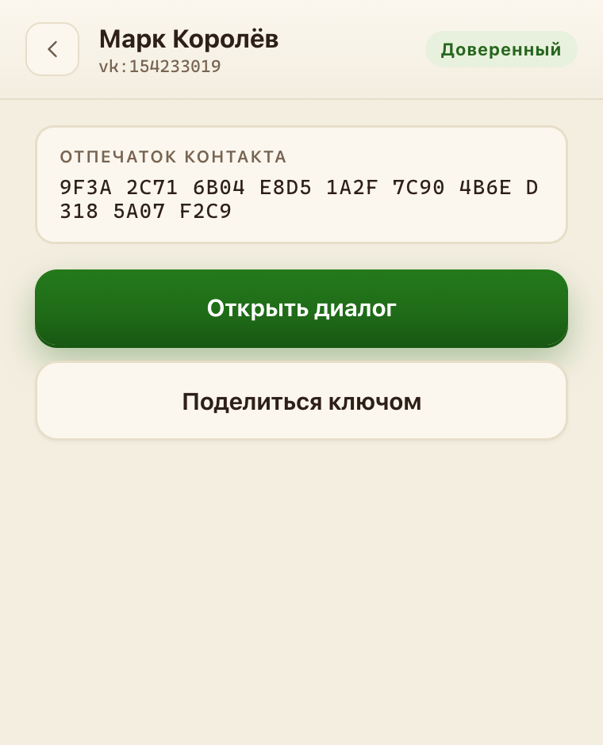
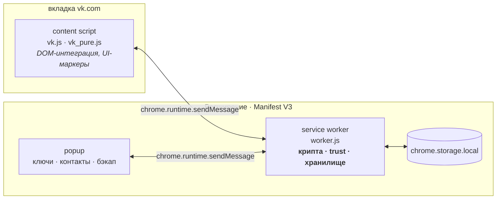
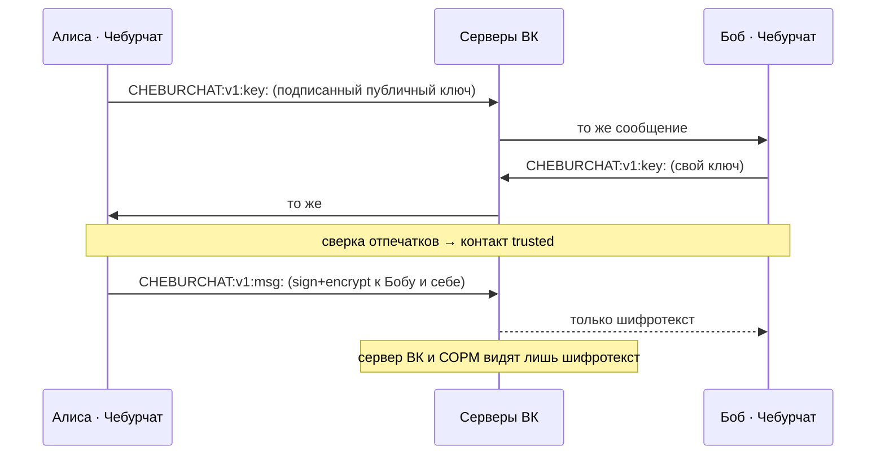

<div align="center">

# Чебурчат

**Сквозное шифрование личных сообщений во ВКонтакте.**
Расширение Chrome (Manifest V3), которое шифрует личные сообщения прямо в интерфейсе ВК: в диалог отправляется шифротекст, а приватный ключ хранится только на устройстве.

[](LICENSE)
[](https://developer.chrome.com/docs/extensions/develop/migrate/what-is-mv3)
[](https://github.com/openpgpjs/openpgpjs)
[-786452.svg)](#разработка)

[Сайт](https://cheburchat.com) · [Chrome Web Store](https://chromewebstore.google.com/detail/%D1%87%D0%B5%D0%B1%D1%83%D1%80%D1%87%D0%B0%D1%82/klgggfipcbbfppeiiifgcmdbjppbfhaf) · [Установка](https://cheburchat.com/install) · [Руководство пользователя](docs/USER_GUIDE.md) · [Технический документ](docs/TECHNICAL.md)

</div>

## Обзор

Чебурчат добавляет E2E-шифрование поверх обычного веб-ВКонтакте, не меняя привычный интерфейс. Когда расширение установлено у обоих собеседников и они обменялись ключами, исходящие сообщения автоматически шифруются перед отправкой и расшифровываются после приёма. Если у получателя расширения нет — переписка идёт в открытом виде, как обычно.

Криптография не самописная: используется [**OpenPGP.js**](https://github.com/openpgpjs/openpgpjs) v6 — зрелая реализация от [ProtonMail](https://proton.me/) с двумя независимыми [аудитами Cure53](https://github.com/openpgpjs/openpgpjs/blob/main/README.md#security-audits). Профиль ограниченный: [Curve25519](https://en.wikipedia.org/wiki/Curve25519) (ECDH) + Ed25519 (подпись), без сжатия, обязательная подпись каждого сообщения.

## Как это выглядит

Сообщение шифруется и расшифровывается прямо в окне чата ВКонтакте — привычный интерфейс не меняется:

<p align="center">
  
</p>

Создание ключа, контакты и проверка отпечатков — в попапе расширения:

<table>
  <tr>
    <td width="33%"></td>
    <td width="33%"></td>
    <td width="33%"></td>
  </tr>
  <tr align="center">
    <td><sub>Создание ключа — приватность по умолчанию</sub></td>
    <td><sub>Контакты и состояния доверия</sub></td>
    <td><sub>Сверка отпечатка ключа</sub></td>
  </tr>
</table>

## Что такое «Чебурчат»?

Название — отсылка к «[Чебурнету](https://neolurk.org/wiki/Чебурнет)»: так иронично называют изолированный, отгороженный от мира рунет ([хроника интернет-цензуры в России — как к этому шло](https://habr.com/ru/articles/1014038/)).

В России давят на VPN, но главное — вводят **«белые списки»**: во время отключений мобильного интернета (всё чаще с 2025 года) доступным остаётся только утверждённый перечень российских сайтов. VPN тут не помогает — суть не в блокировке отдельных ресурсов, а в том, что работают *только* сайты из списка.

ВКонтакте, Max, Mail.ru, сервисы «Яндекса» остаются в этом списке именно потому, что переписка в них не приватна: она идёт в открытом виде, хранится на серверах сервисов и доступна правоохранительным органам. В режиме белых списков работает ровно то, что прозрачно для государства, — ничего по-настоящему защищённого не остаётся.

Чебурчат закрывает эту дыру: даёт слой сквозного шифрования поверх работающих (но просматриваемых) сервисов вроде ВКонтакте. Переписка остаётся доступной даже в режиме белых списков — но больше не читается ни сервером ВК, ни СОРМ.

Подробнее про белые списки: [Википедия](https://ru.wikipedia.org/wiki/%C2%AB%D0%91%D0%B5%D0%BB%D1%8B%D0%B5_%D1%81%D0%BF%D0%B8%D1%81%D0%BA%D0%B8%C2%BB_%D1%81%D0%B0%D0%B9%D1%82%D0%BE%D0%B2_%D0%B2_%D0%A0%D0%BE%D1%81%D1%81%D0%B8%D0%B8) · [Meduza: «…кроме Чебурнета, ничего нет»](https://meduza.io/feature/2025/09/18/vse-uzhe-vhodit-v-rutinu-utrom-i-vecherom-krome-cheburneta-nichego-net).

## Архитектура



**Единый писатель.** Вся криптография, записи в `chrome.storage.local` и логика доверия живут только в background-воркере. Доступ content script к локальному хранилищу закрыт — каждая операция идёт валидированным сообщением воркеру. Воркер сериализует атомарные per-record read-modify-write транзакции без перезаписи всей базы, поэтому параллельные вкладки не теряют поля одной записи. MV3-воркер усыпляется и перезапускается, поэтому операции идемпотентны и не зависят от долгоживущего in-memory состояния.

## Протокол `CHEBURCHAT:v1`

Транспорт — обычный текст сообщения ВК в детектируемой обёртке. Подробности и канонические форматы — в [TECHNICAL.md](docs/TECHNICAL.md) и [MVP_SPEC.md](docs/MVP_SPEC.md).



- **Ключевой анонс** — две строки: человекочитаемое приглашение + `CHEBURCHAT:v1:key:<base64url-json>`. Полезная нагрузка подписана detached-подписью OpenPGP.
- **Сообщение** — `CHEBURCHAT:v1:msg:<base64url>`: sign+encrypt одной операцией к ключу контакта **и** собственному (encrypt-to-self — чтобы перечитывать свою историю).
- Версионируется (`v1`); неизвестные версии помечаются как неподдерживаемые, а не парсятся вслепую.

## Состояния доверия

`missing` → `new` → `trusted`; `changed` при конфликте ключа; `rejected` при явном отклонении. Автошифрование — только для `trusted`. `decrypt_failed` — состояние уровня сообщения и на доверие контакта не влияет. Идентичность платформенно-нейтральна — контакты ключуются парой `(platform, accountId)`, что оставляет задел под другие платформы (Max).

## Структура проекта

```
src/
├── background/   worker.js — роутер сообщений; crypto.js — OpenPGP; store.js — chrome.storage
├── content/      vk.js — DOM-интеграция ВК; vk_pure.js — чистые хелперы (тестируемы отдельно)
├── common/       protocol.js, constants.js, canonical.js, fingerprint.js, base64url.js, helpers.js
├── popup/        popup.{html,css,js} — основной UI (onboarding, контакты, бэкап ключа)
└── options/      options.{html,js} — расширенные настройки
tests/            *.test.js — Node.js test runner
docs/             MVP_SPEC.md (источник правды), TECHNICAL.md, USER_GUIDE.md
site/             исходники cheburchat.com (выносится в отдельный репозиторий)
```

## Модель угроз

| | |
|---|---|
| ✅ Защищает | содержимое от **пассивного хранения и анализа сервером ВК, сетью/провайдером и СОРМ** — в диалог отправляется шифротекст |
| ❌ Не защищает | вредоносное ПО / скомпрометированное устройство; метаданные (кто, кому, когда — это видит ВК); скриншоты и буфер обмена |

На момент публикации не выявлено и аудитом не показано, что текущий клиент ВК передаёт на сервер каждую введённую букву или содержимое черновика. Риск следует только из технической возможности: ввод находится в нативном поле ВК, а расшифрованный текст рендерится в DOM страницы, поэтому активный код страницы мог бы их прочитать.

Чтобы реализовать такой сбор, ВК или атакующий, контролирующий его frontend, должен намеренно добавить соответствующий JavaScript — массово либо адресно для выбранного аккаунта или группы. Для обычного пользователя мы оцениваем этот сценарий как маловероятный; он относится прежде всего к модели целевой атаки на особо ценную цель, а не к обычному сбою расширения. Полностью исключить саму техническую возможность можно только вынеся ввод и чтение в отдельную поверхность расширения — Side Panel, iframe или окно. Это сделало бы переписку менее нативной и удобной, поэтому такая защита не входит в модель текущей беты.

Транспорт также может повторять, дублировать и переупорядочивать уже валидные сообщения. Приватный ключ в бете хранится локально без отдельного пароля — известный security debt, закрытие post-beta. Полная модель — в [TECHNICAL.md](docs/TECHNICAL.md).

## Установка

Расширение опубликовано в **[Chrome Web Store](https://chromewebstore.google.com/detail/%D1%87%D0%B5%D0%B1%D1%83%D1%80%D1%87%D0%B0%D1%82/klgggfipcbbfppeiiifgcmdbjppbfhaf)** — установка в один клик.

Альтернатива — вручную из исходников (сборка не нужна), пошагово на **[cheburchat.com/install](https://cheburchat.com/install)**:

```
1. Скачать ZIP последней версии из Releases и распаковать
2. chrome://extensions → включить «Режим разработчика»
3. «Загрузить распакованное расширение» → выбрать папку
4. Создать ключ в попапе и сохранить резервную копию
```

Пользовательская инструкция — [docs/USER_GUIDE.md](docs/USER_GUIDE.md).

## Разработка

Vanilla JS, **без сборки и бандлера** — расширение грузится прямо из исходников через `manifest.json`. Требуется Chrome 127+.

```bash
npm install      # только dev-зависимости (eslint, тест-раннер не нужен — встроен в node)
npm test         # тесты: крипта, протокол, trust-переходы, парсинг, лимиты
npm run check    # проверка наличия обязательных файлов
npx eslint .     # линтинг
```

Зависимость рантайма одна — [`openpgp`](https://www.npmjs.com/package/openpgp). Источник правды по протоколу и поведению — [docs/MVP_SPEC.md](docs/MVP_SPEC.md).

## Roadmap (планы на будущее)

Идея Чебурчата — приватность поверх сервисов, которые **остаются доступны** даже в режиме белых списков. В том же направлении планы:

- **Мессенджер Max** — поддержка Max как ещё одного транспорта. Модель идентичности уже платформенно-нейтральная (`(platform, accountId)`), менять протокол не придётся.
- **Транспорт поверх почты** — шифрованная переписка через Mail.ru и Яндекс.Почту (они тоже в белых списках) — на случай, когда общего мессенджера нет.
- **Аудиозвонки** — защищённые звонки поверх уже разрешённых сервисов видеоконференцсвязи (WebRTC через Яндекс Телемост и подобные), по принципу [OlcRTC](https://habr.com/ru/articles/1020114/).

## Лицензия

[MIT](LICENSE).
