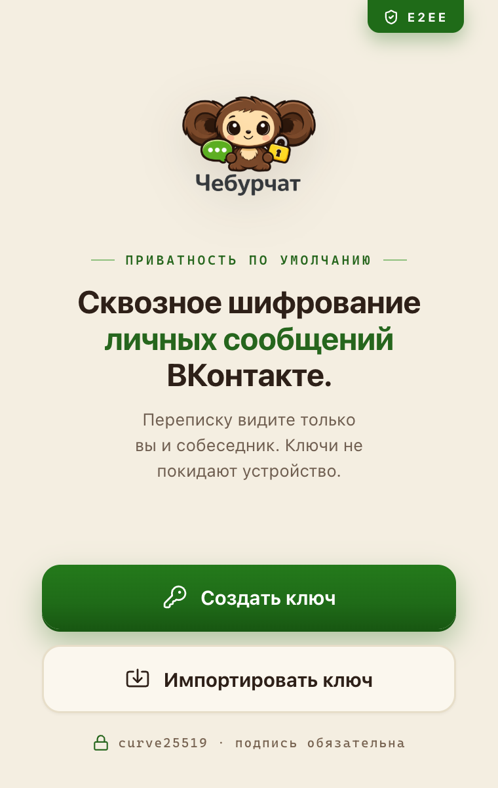
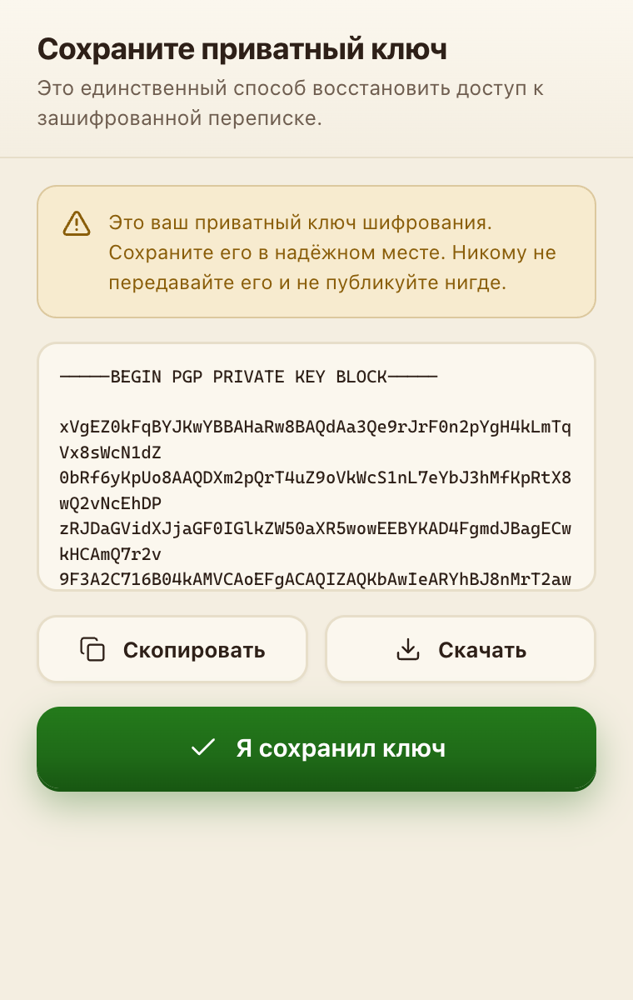
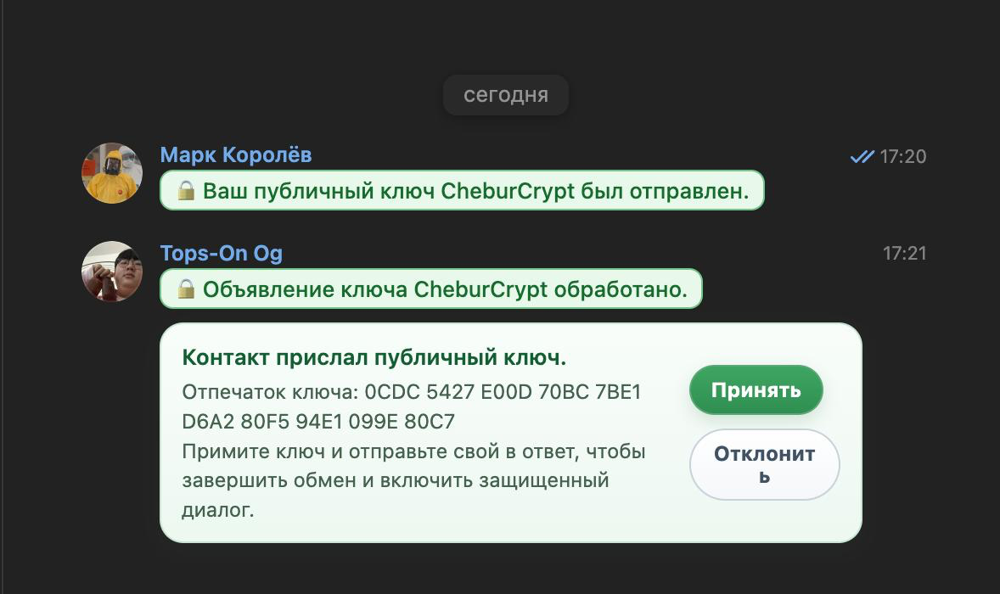
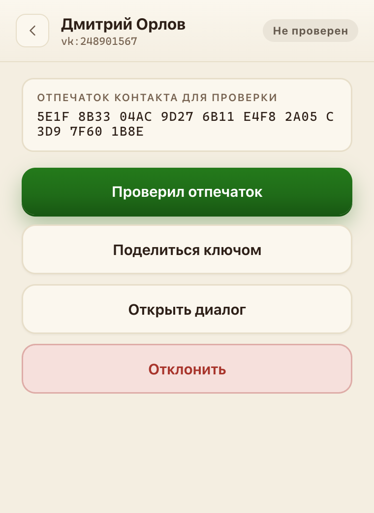
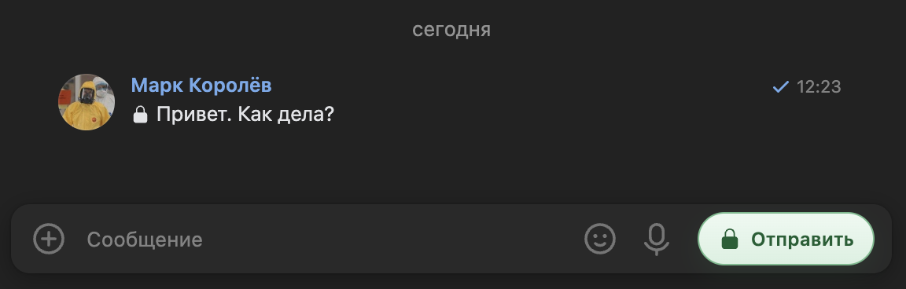
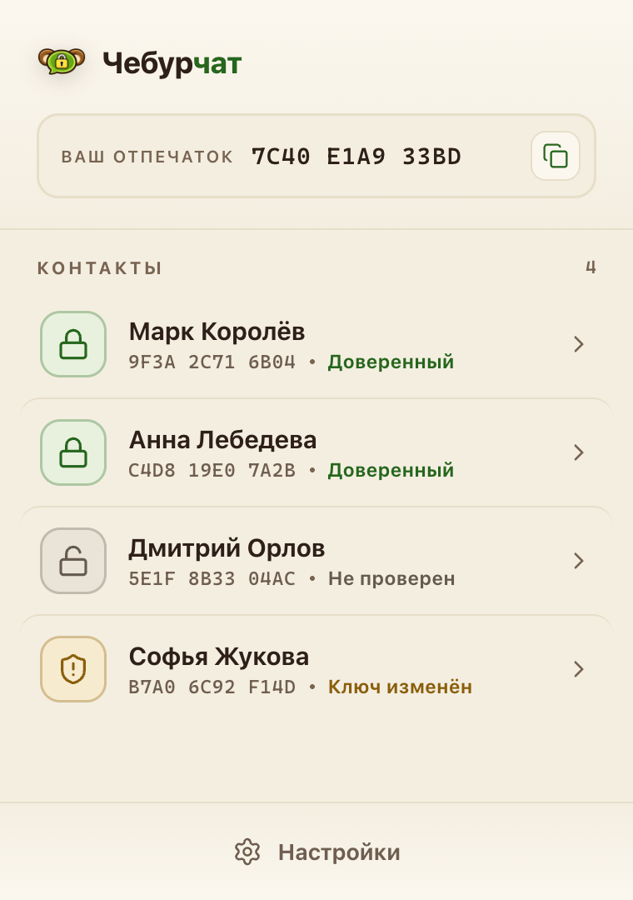
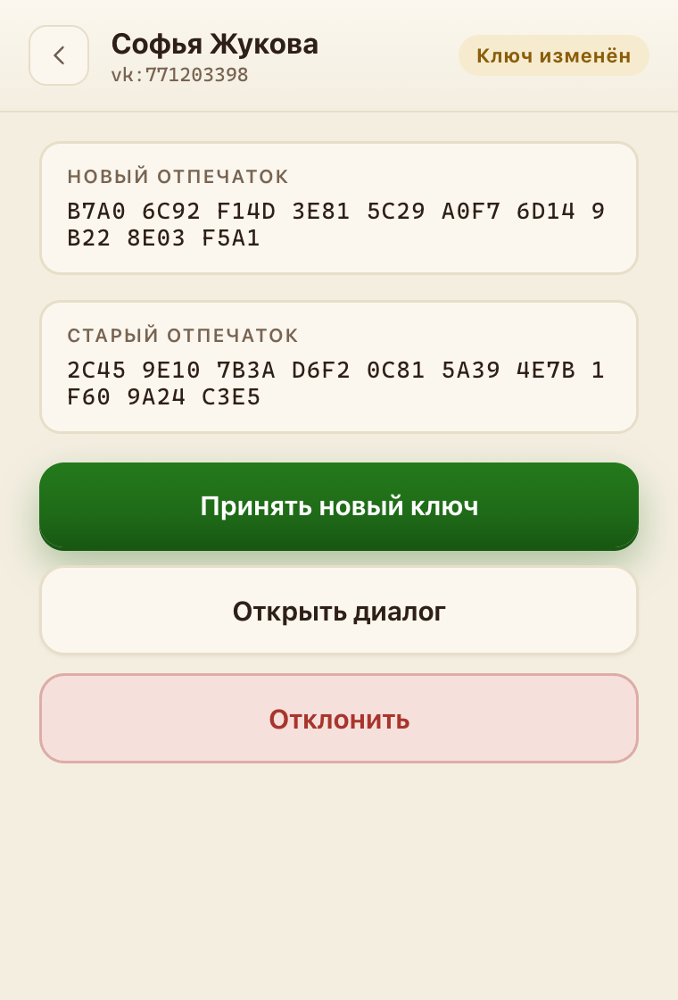

# Руководство пользователя Чебурчата

Чебурчат шифрует личную переписку во ВКонтакте прямо в браузере. Это руководство — для обычного пользователя, без технических подробностей.

## 1. Установка

На время беты расширение ставится вручную — пошаговая инструкция со скриншотами на [cheburchat.com/install](https://cheburchat.com/install). Коротко: скачать с GitHub → `chrome://extensions` → «Режим разработчика» → «Загрузить распакованное расширение».

## 2. Первый запуск: создание ключа

Откройте расширение (иконка на панели Chrome). При первом запуске выберите:

- **Создать ключ** — генерируется ваш личный ключ шифрования. Он создаётся и хранится только на вашем устройстве.
- **Импортировать ключ** — если у вас уже есть ключ (например, переносите с другого устройства), вставьте его текст.

### Резервная копия — обязательно

Сразу после создания сохраните **резервную копию приватного ключа** в надёжном месте (менеджер паролей, зашифрованный файл). 

⚠️ Если вы потеряете ключ, доступ к зашифрованной переписке, связанной с ним, восстановить будет **невозможно** — ни вы, ни кто-либо ещё не сможет её прочитать.

Никому не передавайте приватный ключ и не публикуйте его.

## 3. Обмен ключами с собеседником

Шифрование работает, только когда расширение есть у **обоих** и вы обменялись ключами.

1. Откройте диалог во ВКонтакте.
2. Нажмите **«Поделиться ключом»** — Чебурчат отправит ваш публичный ключ в чат. Для собеседника без расширения это просто сообщение со ссылкой на установку.
3. Собеседник устанавливает Чебурчат и делает то же — отправляет свой ключ вам.
4. Сверьте **отпечаток** ключа собеседника (например, по звонку или при встрече) и нажмите **«Проверил отпечаток»** — контакт станет доверенным.

Обмен ключами происходит прямо в чате — собеседник присылает ключ, вы принимаете его:

Отпечаток сверяют в карточке контакта и подтверждают кнопкой **«Проверил отпечаток»**:

После этого сообщения в диалоге шифруются автоматически:

## 4. Что значат значки и состояния

Рядом с контактом и в поле отправки Чебурчат показывает состояние доверия:

| Состояние | Значок | Что значит | Отправка |
|---|---|---|---|
| **Не проверен** | серый замок | ключ получен, но вы его ещё не подтвердили | в открытом виде |
| **Доверенный** | зелёный замок | ключ подтверждён | шифруется автоматически |
| **Ключ изменён** | предупреждение | пришёл ключ, отличный от сохранённого | заблокировано до проверки |
| **Отклонён** | красный | вы отклонили этот ключ | в открытом виде |
| (нет ключа) | — | у контакта нет ключа Чебурчата | в открытом виде, как обычно |

Зелёный замок = переписка шифруется. Любое другое состояние = сообщения идут как обычный текст ВК.

## 5. «Ключ изменён» — что делать

Если у доверенного контакта вдруг появилось состояние **«Ключ изменён»**, это значит, что пришёл новый ключ, не совпадающий с прежним. Причины бывают разные: собеседник переустановил расширение или создал ключ заново — но в редких случаях это может быть и попытка подмены.

Не торопитесь. Свяжитесь с собеседником по другому каналу, сверьте новый отпечаток и только потом нажмите **«Принять новый ключ»**. До этого шифрование с этим контактом заблокировано.

## 6. Если сообщение не расшифровалось

Иногда отдельное сообщение показывает ошибку расшифровки. Возможные причины: оно зашифровано не вашим ключом, ключ контакта менялся, или сообщение повреждено. Само по себе это не означает подмену ключа — на состояние доверия контакта это не влияет.

## 7. Частые вопросы

**Видит ли ВКонтакте мои сообщения?** Чебурчат отправляет в диалог шифротекст. Нет подтверждений, что текущий клиент ВК передаёт на сервер каждую введённую букву или содержимое черновика; аудит также не показал таких сетевых запросов. Теоретический риск возникает только если ВК или атакующий, контролирующий его frontend, намеренно добавит JavaScript для чтения нативного поля ввода или расшифрованного DOM — массово либо адресно для выбранного пользователя. Для обычного пользователя этот сценарий оценивается как маловероятный и не является обычным сбоем расширения. Полностью устранить саму возможность можно лишь вынесением переписки в отдельную панель или окно расширения, что сделает её менее нативной и удобной. Текущая бета защищает от пассивного хранения и наблюдения со стороны сервера и сети, но не заявляет защиту от такого активного кода страницы, вредоносных расширений и программ на устройстве.

**Это бесплатно?** Да, и [код открыт](https://github.com/darker0n/CheburChat) под лицензией MIT.

**Нужно ли расширение собеседнику?** Да — у обоих, плюс обмен ключами.

**Безопасно ли хранить ключ в браузере?** Ключ хранится локально и не покидает устройство. В текущей бете он пока не защищён отдельным паролем — граница доверия проходит по вашему устройству.

**Будет ли Max и телефоны?** Архитектура не привязана к ВКонтакте; поддержка Max и других платформ — в планах.
